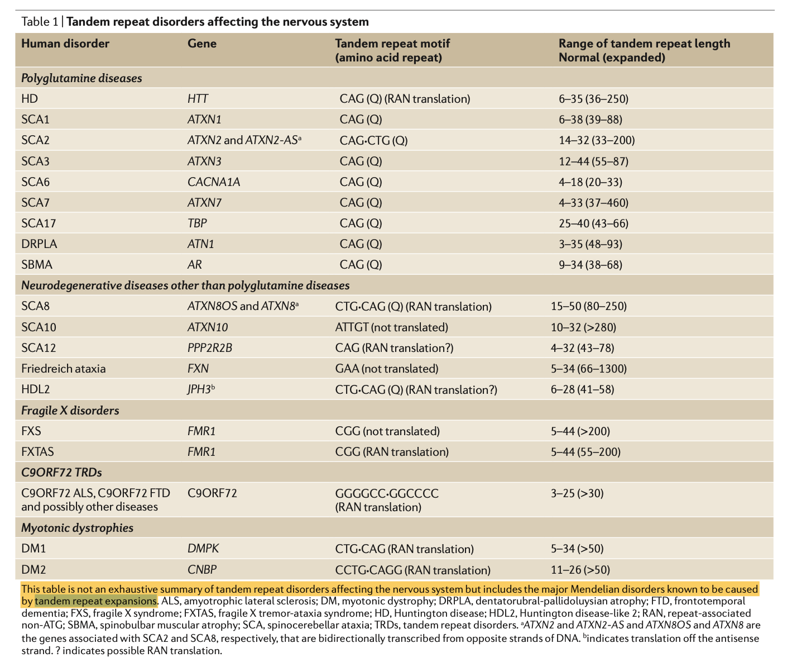

1. 常见的研究方向：

    * Fragile X Syndrome

    * amyotrophic lateral sclerosis

    + 肌萎縮性脊髓側索硬化症

    * Huntington's disease

2. 该分析目前只适用全基因组分析（PCR-free libraries文库，Repeats are only genotyped if the coverage at the locus is at least 10x）

3. 拓展重复数据分析区域的大小默认是1000bp **--repeat-genotype-region-extension-length=1000**

4. dragen在重复序列STR进行检测分析算法如下(illumina团队开发)

   [ExpansionHunter](http://www.genome.org/cgi/doi/10.1101/gr.225672.117)

   [Graph ExpansionHunter](https://doi.org/10.1101/572545)

5. dragen分析的重复序列目前主要针对的是短串联重复序列(STRs,Short tandem repeats)或者称为微卫星DNA(microsatellite DNA)，由1-6重复单元组成 

6. 串联重复序列重复单元>6bp的成为Minisatellite DNA

7. 针对短串联重复序列，拓展的短串联重复序列（tandem repeat expansions）往往与疾病相关，如下图：

参考文献

[Dolzhenko E, van Vugt J J F A, Shaw R J, et al. Detection of long repeat expansions from PCR-free whole-genome sequence data[J]. Genome research, 2017, 27(11): 1895-1903.](http://www.genome.org/cgi/doi/10.1101/gr.225672.117)

[Dolzhenko E, Deshpande V, Schlesinger F, et al. ExpansionHunter: a sequence-graph-based tool to analyze variation in short tandem repeat regions[J]. Bioinformatics, 2019, 35(22): 4754-4756.](https://academic.oup.com/bioinformatics/article/35/22/4754/5499079)

[Anthony J , Hannan. Tandem repeats mediating genetic plasticity in health and disease.[J]. Nature reviews. Genetics, 2018.](https://www.nature.com/articles/nrg.2017.115)